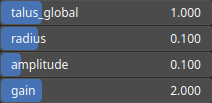

RecastCliff Node
================

RecastCliff add cliffs in a heightmap by introducing sharp changes in elevation to simulate steep vertical terrain features such as cliffs or escarpments.

# Category

Filter/Recast
# Inputs

|Name|Type|Description|
| :--- | :--- | :--- |
|input|Heightmap|Input heightmap.|
|mask|Heightmap|Mask defining the filtering intensity (expected in [0, 1]).|

# Outputs

|Name|Type|Description|
| :--- | :--- | :--- |
|output|Heightmap|Filtered heightmap.|

# Parameters

|Name|Type|Description|
| :--- | :--- | :--- |
|amplitude|Float|Cliff amplitude.|
|gain|Float|Gain, influence the cliff elevation profile.|
|radius|Float|Filter influence radius.|
|talus_global|Float|Reference talus at which the cliff are added.|

# Example

No example available.