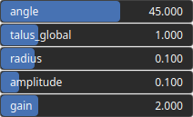

RecastCliffDirectional Node
===========================

TODO

## Category

WIP
## Inputs

|Name|Type|Description|
| :--- | :--- | :--- |
|input|VirtualArray|TODO|
|mask|VirtualArray|Mask defining the filtering intensity (expected in [0, 1]).|

## Outputs

|Name|Type|Description|
| :--- | :--- | :--- |
|output|VirtualArray|TODO|

## Parameters

|Name|Type|Description|
| :--- | :--- | :--- |
|amplitude|Float|TODO|
|angle|Float|TODO Expressed in degrees.|
|gain|Float|TODO|
|radius|Float|TODO|
|talus_global|Float|TODO|

## Example

!!! note "No example yet"
    No example available for this node.
