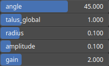

RecastCliffDirectional Node
===========================

TODO

# Category

Filter/Recast
# Inputs

|Name|Type|Description|
| :--- | :--- | :--- |
|input|Heightmap|TODO|
|mask|Heightmap|Mask defining the filtering intensity (expected in [0, 1]).|

# Outputs

|Name|Type|Description|
| :--- | :--- | :--- |
|output|Heightmap|TODO|

# Parameters

|Name|Type|Description|
| :--- | :--- | :--- |
|amplitude|Float|TODO|
|angle|Float|TODO|
|gain|Float|TODO|
|radius|Float|TODO|
|talus_global|Float|TODO|

# Example

No example available.