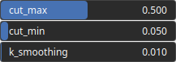

RecastCracks Node
=================

TODO

# Category

Filter/Recast
# Inputs

|Name|Type|Description|
| :--- | :--- | :--- |
|input|VirtualArray|TODO|

# Outputs

|Name|Type|Description|
| :--- | :--- | :--- |
|output|VirtualArray|TODO|

# Parameters

|Name|Type|Description|
| :--- | :--- | :--- |
|cut_max|Float|TODO|
|cut_min|Float|TODO|
|k_smoothing|Float|TODO|

# Example

No example available.  
