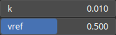

RecastSag Node
==============

RecastSag add cliffs in a heightmap by introducing sinks, droops, or bends downward changes in elevation.

# Category

Filter/Recast
# Inputs

|Name|Type|Description|
| :--- | :--- | :--- |
|input|Heightmap|Input heightmap.|
|mask|Heightmap|Mask defining the filtering intensity (expected in [0, 1]).|

# Outputs

|Name|Type|Description|
| :--- | :--- | :--- |
|output|Heightmap|Filtered heightmap.|

# Parameters

|Name|Type|Description|
| :--- | :--- | :--- |
|k|Float|Smoothing parameter.|
|vref|Float|Reference elevation for the folding.|

# Example

No example available.