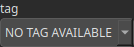

Receive Node
============

Retrieves a heightmap broadcasted by another node using the specified tag.

# Category

Routing
# Outputs

|Name|Type|Description|
| :--- | :--- | :--- |
|output|Heightmap|The heightmap retrieved from the broadcast source.|

# Parameters

|Name|Type|Description|
| :--- | :--- | :--- |
|tag|Choice|Tag identifying the broadcasted heightmap to receive.|

# Example

