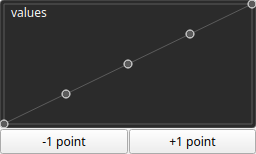

Recurve Node
============

Applies a corrective curve to the heightmap values using a user-defined set of control points.

## Category

Filter/Recurve
## Inputs

|Name|Type|Description|
| :--- | :--- | :--- |
|input|VirtualArray|Heightmap to be modified using the corrective curve.|
|mask|VirtualArray|Mask defining the filtering intensity (expected in [0, 1]).|

## Outputs

|Name|Type|Description|
| :--- | :--- | :--- |
|output|VirtualArray|Resulting heightmap after the curve has been applied.|

## Parameters

|Name|Type|Description|
| :--- | :--- | :--- |
|values|Vector of floats|List of control points defining the curve to remap height values (X = input, Y = output).|

## Example

Corresponding Hesiod file: [Recurve.hsd](../../examples/Recurve.hsd). Use [Ctrl+I] in the node editor to import a hsd file within your current project.

!!! note
    Example files are kept up-to-date with the latest version of [Hesiod](https://github.com/otto-link/Hesiod).
    If you find an error, please [open an issue](https://github.com/otto-link/Hesiod/issues).

