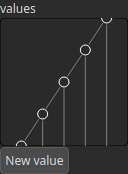

Recurve Node
============

Applies a corrective curve to the heightmap values using a user-defined set of control points.

# Category

Filter/Recurve
# Inputs

|Name|Type|Description|
| :--- | :--- | :--- |
|input|Heightmap|Heightmap to be modified using the corrective curve.|
|mask|Heightmap|Mask defining the filtering intensity (expected in [0, 1]).|

# Outputs

|Name|Type|Description|
| :--- | :--- | :--- |
|output|Heightmap|Resulting heightmap after the curve has been applied.|

# Parameters

|Name|Type|Description|
| :--- | :--- | :--- |
|values|Vector of floats|List of control points defining the curve to remap height values (X = input, Y = output).|

# Example

