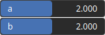

RecurveKura Node
================

RecurveKura is an operator based on the Kumaraswamy distribution that can be used to adjust the amplitude levels of a dataset.

# Category

Filter/Recurve
# Inputs

|Name|Type|Description|
| :--- | :--- | :--- |
|input|VirtualArray|Input heightmap.|
|mask|VirtualArray|Mask defining the filtering intensity (expected in [0, 1]).|

# Outputs

|Name|Type|Description|
| :--- | :--- | :--- |
|output|VirtualArray|Filtered heightmap.|

# Parameters

|Name|Type|Description|
| :--- | :--- | :--- |
|a|Float|Primarily controls the rightward skewness and tail behavior of the distribution.|
|b|Float|Primarily controls the leftward skewness and tail behavior.|

# Example

No example available.