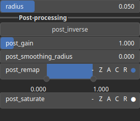

RelativeElevation Node
======================

RelativeElevation identifies heightmap relative elevation based on the surrounding heightmap values.

# Category

Features/Landform
# Inputs

|Name|Type|Description|
| :--- | :--- | :--- |
|input|Heightmap|Input heightmap.|

# Outputs

|Name|Type|Description|
| :--- | :--- | :--- |
|output|Heightmap|Relative elevation.|

# Parameters

|Name|Type|Description|
| :--- | :--- | :--- |
|post_gain|Float|No description|
|post_inverse|Bool|No description|
|post_remap|Value range|No description|
|post_saturate|Value range|No description|
|post_smoothing_radius|Float|No description|
|radius|Float|Filter radius with respect to the domain size.|

# Example

No example available.