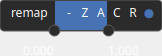

Remap Node
==========

The Remap operator is used to adjust the elevation values across the entire dataset, effectively changing the range of elevation data to match a desired output scale or to normalize the data.

# Category

Filter/Range
# Inputs

|Name|Type|Description|
| :--- | :--- | :--- |
|input|Heightmap|Input heightmap.|

# Outputs

|Name|Type|Description|
| :--- | :--- | :--- |
|output|Heightmap|Remapped heightmap.|

# Parameters

|Name|Type|Description|
| :--- | :--- | :--- |
|remap|Value range|Target range: define the new minimum and maximum values to remap the elevation values to.|

# Example

