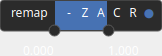

Remap Node
==========

The Remap operator is used to adjust the elevation values across the entire dataset, effectively changing the range of elevation data to match a desired output scale or to normalize the data.

## Category

Filter/Range
## Inputs

|Name|Type|Description|
| :--- | :--- | :--- |
|input|VirtualArray|Input heightmap.|

## Outputs

|Name|Type|Description|
| :--- | :--- | :--- |
|output|VirtualArray|Remapped heightmap.|

## Parameters

|Name|Type|Description|
| :--- | :--- | :--- |
|remap|Value range|Target range: define the new minimum and maximum values to remap the elevation values to.|

## Example

Corresponding Hesiod file: [Remap.hsd](../../examples/Remap.hsd). Use [Ctrl+I] in the node editor to import a hsd file within your current project.

!!! note
    Example files are kept up-to-date with the latest version of [Hesiod](https://github.com/otto-link/Hesiod).
    If you find an error, please [open an issue](https://github.com/otto-link/Hesiod/issues).

