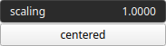

Rescale Node
============

The Rescale operator involves adjusting each data point by multiplying it with a predetermined constant.

## Category

Filter/Range
## Inputs

|Name|Type|Description|
| :--- | :--- | :--- |
|input|VirtualArray|Input heightmap.|

## Outputs

|Name|Type|Description|
| :--- | :--- | :--- |
|output|VirtualArray|Rescaled heightmap.|

## Parameters

|Name|Type|Description|
| :--- | :--- | :--- |
|centered|Bool|Determine whether a mean offset is applied to the values to center the scaling.|
|scaling|Float|Constant by which each elevation values will be multiplied.|

## Example

Corresponding Hesiod file: [Rescale.hsd](../../examples/Rescale.hsd). Use [Ctrl+I] in the node editor to import a hsd file within your current project.

!!! note
    Example files are kept up-to-date with the latest version of [Hesiod](https://github.com/otto-link/Hesiod).
    If you find an error, please [open an issue](https://github.com/otto-link/Hesiod/issues).

