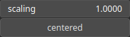

Rescale Node
============

The Rescale operator involves adjusting each data point by multiplying it with a predetermined constant.

# Category

Filter/Range
# Inputs

|Name|Type|Description|
| :--- | :--- | :--- |
|input|Heightmap|Input heightmap.|

# Outputs

|Name|Type|Description|
| :--- | :--- | :--- |
|output|Heightmap|Rescaled heightmap.|

# Parameters

|Name|Type|Description|
| :--- | :--- | :--- |
|centered|Bool|Determine whether a mean offset is applied to the values to center the scaling.|
|scaling|Float|Constant by which each elevation values will be multiplied.|

# Example

No example available.