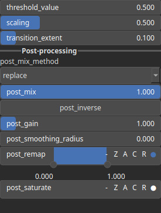

ReverseAboveThreshold Node
==========================

No description available

# Category

Filter/Recurve
# Inputs

|Name|Type|Description|
| :--- | :--- | :--- |
|input|Heightmap|No description|
|mask|Heightmap|No description|
|threshold|Heightmap|No description|

# Outputs

|Name|Type|Description|
| :--- | :--- | :--- |
|output|Heightmap|No description|

# Parameters

|Name|Type|Description|
| :--- | :--- | :--- |
|post_gain|Float|No description|
|post_inverse|Bool|No description|
|post_mix|Float|No description|
|post_mix_method|Enumeration|No description|
|post_remap|Value range|No description|
|post_smoothing_radius|Float|No description|
|scaling|Float|No description|
|threshold_value|Float|No description|
|transition_extent|Float|No description|

# Example

