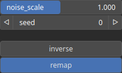

ReverseMidpoint Node
====================

ReverseMidpoint generates an heightmap. It uses a polyline as a base, then recursively interpolate and displace midpoints to generate a terrain.

# Category

WIP
# Inputs

|Name|Type|Description|
| :--- | :--- | :--- |
|path|Path|Set of points (x, y) and elevations z.|

# Outputs

|Name|Type|Description|
| :--- | :--- | :--- |
|heightmap|Heightmap|Interpolated heightmap.|

# Parameters

|Name|Type|Description|
| :--- | :--- | :--- |
|inverse|Bool|Toggle inversion of the output values.|
|noise_scale|Float|Added noise scaling.|
|remap|Bool|Remap the operator's output to a specified range, defaulting to [0, 1].|
|Seed|Random seed number|Random seed number. The random seed is an offset to the randomized process. A different seed will produce a new result.|

# Example

No example available.