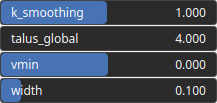

Ridgelines Node
===============

Ridgelines generates an heightmap assuming the input path defines a ridgeline.

# Category

Primitive/Authoring
# Inputs

|Name|Type|Description|
| :--- | :--- | :--- |
|dx|Heightmap|Displacement with respect to the domain size (x-direction).|
|dy|Heightmap|Displacement with respect to the domain size (y-direction).|
|path|Path|Set of points (x, y) and elevations z.|

# Outputs

|Name|Type|Description|
| :--- | :--- | :--- |
|heightmap|Heightmap|Interpolated heightmap.|

# Parameters

|Name|Type|Description|
| :--- | :--- | :--- |
|k_smoothing|Float|Smoothing intensity.|
|talus_global|Float|Ridge slope.|
|vmin|Float|Minimum value (lower values are clamped).|
|width|Float|Ridge edge width.|

# Example

