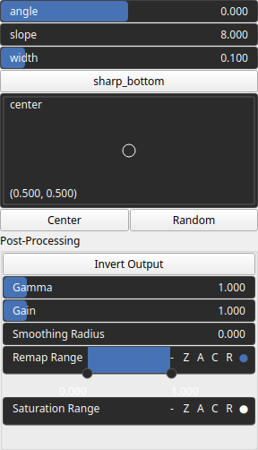

Rift Node
=========

Rift is a procedural primitive used to represent a conceptualized geological rift or elongated depression with configurable radial profiles, slopes, and bottom shaping.

## Category

Primitive/Geological
## Inputs

|Name|Type|Description|
| :--- | :--- | :--- |
|dr|VirtualArray|Optional noise field used to locally modulate the rift radius.|
|envelope|VirtualArray|Heightmap used as a post-process amplitude multiplier for the generated noise.|
|offset|VirtualArray|Optional noise field used to locally offset the rift axis position.|

## Outputs

|Name|Type|Description|
| :--- | :--- | :--- |
|bottom_mask|VirtualArray|No description|
|output|VirtualArray|Generated rift heightmap.|
|rift_mask|VirtualArray|Mask representing the spatial extent and influence of the rift structure.|

## Parameters

|Name|Type|Description|
| :--- | :--- | :--- |
|Angle|Float|Orientation angle of the rift axis in degrees.|
|Axial Slope|Float|Longitudinal slope applied along the rift axis.|
|Bottom Depth|Float|Additional depth contribution applied to the inner bottom region of the rift.|
|Bottom Extent|Float|Relative width of the inner bottom region inside the rift.|
|Ensure Minimum Depth|Bool|No description|
|Bottom Profile|Enumeration|Profile function used to shape the bottom region of the rift.|
|Bottom Profile Sharpness|Float|Additional shaping parameter associated with the selected bottom profile.|
|Center|Vec2Float|Reference center within the heightmap. Coordinates are in domain units; center.y is measured from the bottom of the map (y increases upward).|
|Depth|Float|Overall depth amplitude of the rift.|
|Activate|Bool|Enables or disables the built-in drainage noise. If an external noise input is provided, it overrides this default noise.|
|Spatial Frequency|Float|Base spatial frequencies in the X and Y directions.|
|Amplitude|Float|Noise amplitude.|
|Type|Enumeration|Noise type.|
|Seed|Random seed number|Random seed number. The random seed is an offset to the randomized process. A different seed will produce a new result.|
|Smoothness|Float|Controls the resulting smoothness of the fractal layering process.|
|Outer Slope|Float|Controls the steepness of the outer falloff surrounding the rift.|
|Gain|Float|Mid-centered gain transformation applied to the elevation values. This is a non-linear recurve operator centered around the mid elevation (typically 0.5). Increasing the gain pushes values toward the minimum and maximum elevations, creating flatter low/high regions with a steeper transition around the midpoint.|
|Gamma|Float|Standard gamma correction applied to the elevation values. This is a monotonic power-law remapping that shifts emphasis toward low or high elevations, making the overall shape sharper or bulkier without changing its ordering.|
|Invert Output|Bool|Inverts the output values after processing, flipping low and high values across the midrange.|
|Remap Range|Value range|Linearly remaps the output values to a specified target range (default is [0, 1]).|
|Saturation Range|Value range|Modifies the amplitude of elevations by first clamping them to a given interval and then scaling them so that the restricted interval matches the original input range. This enhances contrast in elevation variations while maintaining overall structure.|
|Smoothing Radius|Float|Defines the radius for post-processing smoothing, determining the size of the neighborhood used to average local values and reduce high-frequency detail. A radius of 0 disables smoothing.|
|Profile|Enumeration|Profile function used to shape the outer rift cross-section.|
|Profile Sharpness|Float|Additional shaping parameter associated with the selected outer profile.|
|Radius|Float|Half-width of the rift in normalized domain units. Specified in domain units (same scale as center); on a non-square map the footprint is therefore elliptical, since x and y span different physical extents.|
|Scale Radius with Depth|Bool|If enabled, the rift radius and related features scale proportionally with the depth value.|

## Example

Corresponding Hesiod file: [Rift.hsd](../../examples/Rift.hsd). Use [Ctrl+I] in the node editor to import a hsd file within your current project.

!!! note
    Example files are kept up-to-date with the latest version of [Hesiod](https://github.com/otto-link/Hesiod).
    If you find an error, please [open an issue](https://github.com/otto-link/Hesiod/issues).

