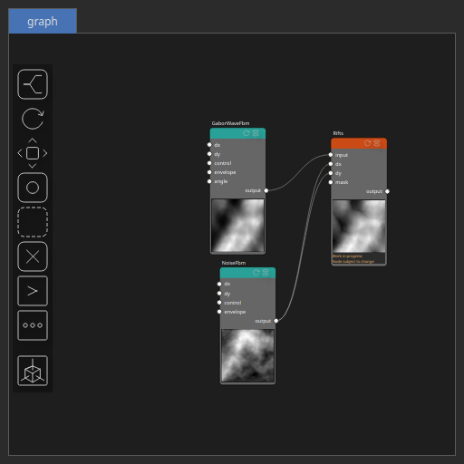

Rifts Node
==========

No description available

# Category

Erosion/Hydraulic
# Inputs

|Name|Type|Description|
| :--- | :--- | :--- |
|dx|Heightmap|No description|
|dy|Heightmap|No description|
|input|Heightmap|No description|
|mask|Heightmap|No description|

# Outputs

|Name|Type|Description|
| :--- | :--- | :--- |
|output|Heightmap|No description|

# Parameters

|Name|Type|Description|
| :--- | :--- | :--- |
|amplitude|Float|No description|
|angle|Float|No description|
|apply_mask|Bool|No description|
|center|Vec2Float|No description|
|clamp_vmin|Float|No description|
|elevation_noise_amp|Float|No description|
|elevation_noise_shift|Float|No description|
|k_smooth_bottom|Float|No description|
|k_smooth_top|Float|No description|
|kw|Wavenumber|No description|
|mask_activate|Bool|No description|
|mask_gain|Float|No description|
|mask_gamma|Float|No description|
|mask_inverse|Bool|No description|
|mask_radius|Float|No description|
|mask_type|Choice|No description|
|post_gain|Float|Set the gain. Gain is a power law transformation altering the distribution of signal values, compressing or expanding certain regions of the signal depending on the exponent of the power law.|
|post_inverse|Bool|Inverts the output values after processing, flipping low and high values across the midrange.|
|post_mix|Float|Mixing factor for blending input and output values. A value of 0 uses only the input, 1 uses only the output, and intermediate values perform a linear interpolation.|
|post_mix_method|Enumeration|Method used to combine input and output values. Options include linear interpolation (default), min, max, smooth min, smooth max, add, and subtract.|
|post_remap|Value range|Linearly remaps the output values to a specified target range (default is [0, 1]).|
|post_saturate|Value range|Modifies the amplitude of elevations by first clamping them to a given interval and then scaling them so that the restricted interval matches the original input range. This enhances contrast in elevation variations while maintaining overall structure.|
|post_smoothing_radius|Float|Defines the radius for post-processing smoothing, determining the size of the neighborhood used to average local values and reduce high-frequency detail. A radius of 0 disables smoothing.|
|radial_spread_amp|Float|No description|
|remap_vmin|Float|No description|
|reverse_mask|Bool|No description|
|seed|Random seed number|No description|

# Example

Corresponding Hesiod file: [Rifts.hsd](../../examples/Rifts.hsd). Use [Ctrl+I] in the node editor to import a hsd file within your current project. 

> **Note:** Example files are kept up-to-date with the latest version of [Hesiod](https://github.com/otto-link/Hesiod).
> If you find an error, please [open an issue](https://github.com/otto-link/Hesiod/issues).

  
# Screenshots

Before/after:

