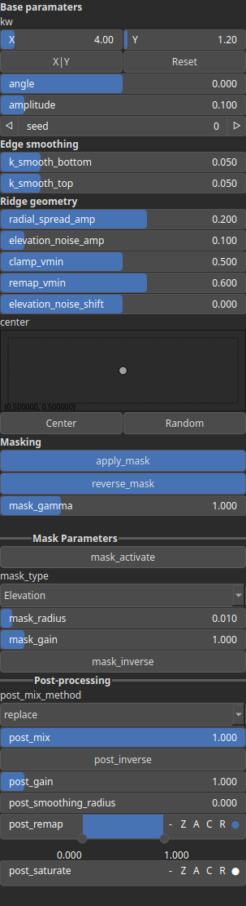

Rifts Node
==========

No description available

# Category

Erosion/Hydraulic
# Inputs

|Name|Type|Description|
| :--- | :--- | :--- |
|dx|Heightmap|No description|
|dy|Heightmap|No description|
|input|Heightmap|No description|
|mask|Heightmap|No description|

# Outputs

|Name|Type|Description|
| :--- | :--- | :--- |
|output|Heightmap|No description|

# Parameters

|Name|Type|Description|
| :--- | :--- | :--- |
|amplitude|Float|No description|
|angle|Float|No description|
|apply_mask|Bool|No description|
|center|Vec2Float|No description|
|clamp_vmin|Float|No description|
|elevation_noise_amp|Float|No description|
|elevation_noise_shift|Float|No description|
|k_smooth_bottom|Float|No description|
|k_smooth_top|Float|No description|
|kw|Wavenumber|No description|
|mask_activate|Bool|No description|
|mask_gain|Float|No description|
|mask_gamma|Float|No description|
|mask_inverse|Bool|No description|
|mask_radius|Float|No description|
|mask_type|Choice|No description|
|post_gain|Float|No description|
|post_inverse|Bool|No description|
|post_mix|Float|No description|
|post_mix_method|Enumeration|No description|
|post_remap|Value range|No description|
|post_smoothing_radius|Float|No description|
|radial_spread_amp|Float|No description|
|remap_vmin|Float|No description|
|reverse_mask|Bool|No description|
|seed|Random seed number|No description|

# Example

Corresponding Hesiod file: [Rifts.hsd](../../examples/Rifts.hsd). 

> **Note:** Example files are kept up-to-date with the latest version of [Hesiod](https://github.com/otto-link/Hesiod).
> If you find an error, please [open an issue](https://github.com/otto-link/Hesiod/issues).

