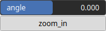

Rotate Node
===========

No description available

## Category

Operator/Transform
## Inputs

|Name|Type|Description|
| :--- | :--- | :--- |
|input|VirtualArray|No description|

## Outputs

|Name|Type|Description|
| :--- | :--- | :--- |
|output|VirtualArray|No description|

## Parameters

|Name|Type|Description|
| :--- | :--- | :--- |
|angle|Float|Expressed in degrees.|
|zoom_in|Bool|No description|

## Example

Corresponding Hesiod file: [Rotate.hsd](../../examples/Rotate.hsd). Use [Ctrl+I] in the node editor to import a hsd file within your current project.

!!! note
    Example files are kept up-to-date with the latest version of [Hesiod](https://github.com/otto-link/Hesiod).
    If you find an error, please [open an issue](https://github.com/otto-link/Hesiod/issues).

