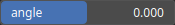
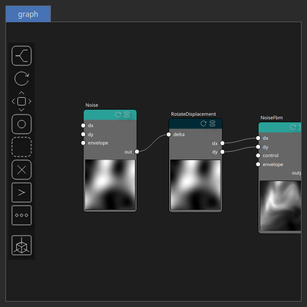

RotateDisplacement Node
=======================

No description available

# Category

Math
# Inputs

|Name|Type|Description|
| :--- | :--- | :--- |
|delta|Heightmap|No description|

# Outputs

|Name|Type|Description|
| :--- | :--- | :--- |
|dx|Heightmap|Displacement with respect to the domain size (x-direction).|
|dy|Heightmap|Displacement with respect to the domain size (y-direction).|

# Parameters

|Name|Type|Description|
| :--- | :--- | :--- |
|angle|Float|No description|

# Example

Corresponding Hesiod file: [RotateDisplacement.hsd](../../examples/RotateDisplacement.hsd). Use [Ctrl+I] in the node editor to import a hsd file within your current project. 

> **Note:** Example files are kept up-to-date with the latest version of [Hesiod](https://github.com/otto-link/Hesiod).
> If you find an error, please [open an issue](https://github.com/otto-link/Hesiod/issues).

