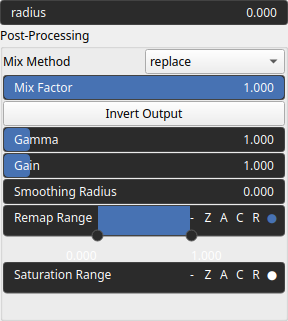

Ruggedness Node
===============

Measures the terrain roughness by computing the square root of the sum of squared elevation differences within a specified radius. Indicates how rough or smooth the terrain is by analyzing how much the elevation changes between neighboring areas. Higher values mean a more rugged, uneven surface, while lower values indicate a flatter, smoother landscape.

# Category

Features
# Inputs

|Name|Type|Description|
| :--- | :--- | :--- |
|input|Heightmap|Heightmap input representing terrain elevations, used to calculate ruggedness.|

# Outputs

|Name|Type|Description|
| :--- | :--- | :--- |
|output|Heightmap|Resulting heightmap where each pixel represents the calculated ruggedness value.|

# Parameters

|Name|Type|Description|
| :--- | :--- | :--- |
|Gain|Float|Set the gain. Gain is a power law transformation altering the distribution of signal values, compressing or expanding certain regions of the signal depending on the exponent of the power law.|
|Gamma|Float|No description|
|Invert Output|Bool|Inverts the output values after processing, flipping low and high values across the midrange.|
|Remap Range|Value range|Linearly remaps the output values to a specified target range (default is [0, 1]).|
|Saturation Range|Value range|Modifies the amplitude of elevations by first clamping them to a given interval and then scaling them so that the restricted interval matches the original input range. This enhances contrast in elevation variations while maintaining overall structure.|
|Smoothing Radius|Float|Defines the radius for post-processing smoothing, determining the size of the neighborhood used to average local values and reduce high-frequency detail. A radius of 0 disables smoothing.|
|radius|Float|Defines the neighborhood radius used for computing ruggedness. Larger values consider a wider area, capturing broader terrain variations.|

# Example

No example available.