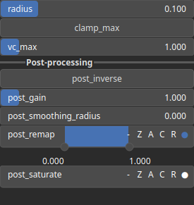

Rugosity Node
=============

Rugosity identifies heightmap rugosity, i.e. the roughness or irregularity of the surface.

# Category

Features
# Inputs

|Name|Type|Description|
| :--- | :--- | :--- |
|input|Heightmap|Input heightmap.|

# Outputs

|Name|Type|Description|
| :--- | :--- | :--- |
|output|Heightmap|Rugosity.|

# Parameters

|Name|Type|Description|
| :--- | :--- | :--- |
|GPU|Bool|Toogle GPU acceleration on or off.|
|clamp_max|Bool|Decides whether the rugosity values are clamped.|
|inverse|Bool|Toggle inversion of the output values.|
|radius|Float|Filter radius with respect to the domain size.|
|saturate|Value range|A process that modifies the amplitude of elevations by first clamping them to a given interval and then scaling them so that the restricted interval matches the original input range. This enhances contrast in elevation variations while maintaining overall structure.|
|smoothing|Bool|Enable or disable smoothing to reduce noise in the curvature computation.|
|smoothing_radius|Float|Specifies the radius for smoothing, determining how much the curvature is averaged over neighboring pixels.|
|vc_max|Float|Rugosity clamping upper bound.|

# Example

