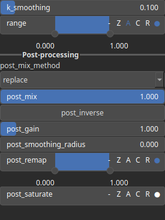

Saturate Node
=============

A process that modifies the amplitude of elevations by first clamping them to a given interval and then scaling them so that the restricted interval matches the original input range. This enhances contrast in elevation variations while maintaining overall structure.

# Category

Filter/Recurve
# Inputs

|Name|Type|Description|
| :--- | :--- | :--- |
|input|Heightmap|Input heightmap.|

# Outputs

|Name|Type|Description|
| :--- | :--- | :--- |
|output|Heightmap|Saturated heightmap.|

# Parameters

|Name|Type|Description|
| :--- | :--- | :--- |
|k_smoothing|Float|Smoothing intensity.|
|range|Value range|Saturation range: define the minimum and maximum values of the saturation process.|

# Example

