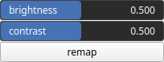

ScanMask Node
=============

ScanMask adjusts the brightness and contrast of an input mask.

# Category

Terrain Features/Mask Operations
# Inputs

|Name|Type|Description|
| :--- | :--- | :--- |
|input|VirtualArray|Input heightmap.|

# Outputs

|Name|Type|Description|
| :--- | :--- | :--- |
|output|VirtualArray|Adjusted heightmap.|

# Parameters

|Name|Type|Description|
| :--- | :--- | :--- |
|brightness|Float|Brightness adjustment.|
|contrast|Float|Contrast adjustment.|
|remap|Bool|Remap the operator's output to a specified range, defaulting to [0, 1].|

# Example

No example available.  
