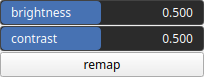

ScanMask Node
=============

ScanMask adjusts the brightness and contrast of an input mask.

## Category

Terrain Features/Mask Operations
## Inputs

|Name|Type|Description|
| :--- | :--- | :--- |
|input|VirtualArray|Input heightmap.|

## Outputs

|Name|Type|Description|
| :--- | :--- | :--- |
|output|VirtualArray|Adjusted heightmap.|

## Parameters

|Name|Type|Description|
| :--- | :--- | :--- |
|brightness|Float|Brightness adjustment.|
|contrast|Float|Contrast adjustment.|
|remap|Bool|Remap the operator's output to a specified range, defaulting to [0, 1].|

## Example

Corresponding Hesiod file: [ScanMask.hsd](../../examples/ScanMask.hsd). Use [Ctrl+I] in the node editor to import a hsd file within your current project.

!!! note
    Example files are kept up-to-date with the latest version of [Hesiod](https://github.com/otto-link/Hesiod).
    If you find an error, please [open an issue](https://github.com/otto-link/Hesiod/issues).

