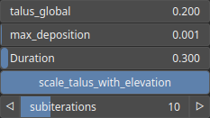

SedimentDeposition Node
=======================

TODO

# Category

WIP
# Inputs

|Name|Type|Description|
| :--- | :--- | :--- |
|input|VirtualArray|TODO|
|mask|VirtualArray|Mask defining the filtering intensity (expected in [0, 1]).|

# Outputs

|Name|Type|Description|
| :--- | :--- | :--- |
|deposition|VirtualArray|Deposition map (in [0, 1]).|
|output|VirtualArray|TODO|

# Parameters

|Name|Type|Description|
| :--- | :--- | :--- |
|Duration|Float|No description|
|max_deposition|Float|TODO|
|scale_talus_with_elevation|Bool|Scales the talus amplitude based on heightmap elevation, reducing it at lower elevations and maintaining the nominal value at higher elevations.|
|subiterations|Integer|No description|
|talus_global|Float|TODO|

# Example

No example available.