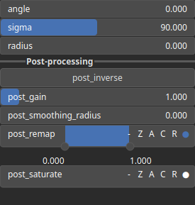

SelectAngle Node
================

SelectAngle is a thresholding operator. It selects angle values within a specified range defined by the shape of a Gaussian pulse.

# Category

Mask/Selector
# Inputs

|Name|Type|Description|
| :--- | :--- | :--- |
|input|Heightmap|Input heightmap.|

# Outputs

|Name|Type|Description|
| :--- | :--- | :--- |
|output|Heightmap|Mask heightmap (in [0, 1]).|

# Parameters

|Name|Type|Description|
| :--- | :--- | :--- |
|angle|Float|Selection center value.|
|inverse|Bool|Toggle inversion of the output values.|
|radius|Float|Pre-filter radius.|
|sigma|Float|Selection half-width.|
|smoothing|Bool|Enable or disable smoothing to reduce noise in the curvature computation.|
|smoothing_radius|Float|Specifies the radius for smoothing, determining how much the curvature is averaged over neighboring pixels.|

# Example

