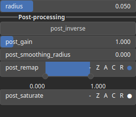

SelectBlobLog Node
==================

SelectBlobLog performs 'blob' detection using oa Laplacian of Gaussian (log) method. Blobs are areas in an image that are either brighter or darker than the surrounding areas.

# Category

Mask/Selector
# Inputs

|Name|Type|Description|
| :--- | :--- | :--- |
|input|Heightmap|Input heightmap.|

# Outputs

|Name|Type|Description|
| :--- | :--- | :--- |
|output|Heightmap|Mask heightmap (in [0, 1]).|

# Parameters

|Name|Type|Description|
| :--- | :--- | :--- |
|post_gain|Float|No description|
|post_inverse|Bool|No description|
|post_remap|Value range|No description|
|post_smoothing_radius|Float|No description|
|radius|Float|Detection radius with respect to the domain size.|

# Example

