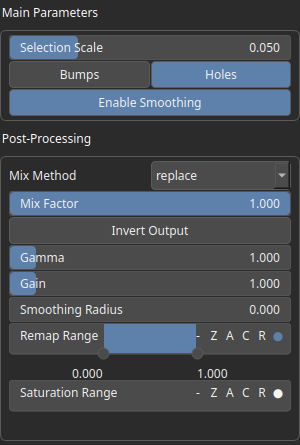

SelectCavities Node
===================

SelectCavities analyzes the curvature of an heightmap to identify concave or convex features such as valleys, depressions, ridges, or peaks.

# Category

Mask/Selector
# Inputs

|Name|Type|Description|
| :--- | :--- | :--- |
|input|Heightmap|Input heightmap.|

# Outputs

|Name|Type|Description|
| :--- | :--- | :--- |
|output|Heightmap|Mask heightmap (in [0, 1]).|

# Parameters

|Name|Type|Description|
| :--- | :--- | :--- |
|concave|Bool|Decides whether concave or convex features are detected.|
|post_gain|Float|No description|
|post_inverse|Bool|No description|
|post_remap|Value range|No description|
|post_smoothing_radius|Float|No description|
|radius|Float|Detection radius with respect to the domain size.|

# Example

