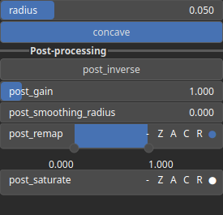

SelectCavities Node
===================

SelectCavities analyzes the curvature of an heightmap to identify concave or convex features such as valleys, depressions, ridges, or peaks.

# Category

Mask/Selector
# Inputs

|Name|Type|Description|
| :--- | :--- | :--- |
|input|Heightmap|Input heightmap.|

# Outputs

|Name|Type|Description|
| :--- | :--- | :--- |
|output|Heightmap|Mask heightmap (in [0, 1]).|

# Parameters

|Name|Type|Description|
| :--- | :--- | :--- |
|concave|Bool|Decides whether concave or convex features are detected.|
|inverse|Bool|Toggle inversion of the output values.|
|radius|Float|Detection radius with respect to the domain size.|
|smoothing|Bool|Enable or disable smoothing to reduce noise in the curvature computation.|
|smoothing_radius|Float|Specifies the radius for smoothing, determining how much the curvature is averaged over neighboring pixels.|

# Example

