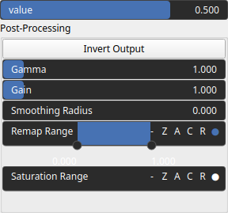

SelectGt Node
=============

SelectGt is a thresholding operator. It transforms an input heightmap into a binary heightmap, where each pixel is assigned either a value of 0 or 1, depending on whether its intensity value surpasses a specified threshold value.

# Category

Mask/Selector
# Inputs

|Name|Type|Description|
| :--- | :--- | :--- |
|input|Heightmap|Input heightmap.|

# Outputs

|Name|Type|Description|
| :--- | :--- | :--- |
|output|Heightmap|Mask heightmap (in [0, 1]).|

# Parameters

|Name|Type|Description|
| :--- | :--- | :--- |
|post_gain|Float|No description|
|post_inverse|Bool|No description|
|post_remap|Value range|No description|
|post_smoothing_radius|Float|No description|
|value|Float|Selection value.|

# Example

