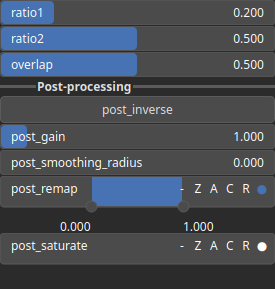

SelectMultiband3 Node
=====================

TODO

# Category

Mask/Selector
# Inputs

|Name|Type|Description|
| :--- | :--- | :--- |
|input|Heightmap|TODO|

# Outputs

|Name|Type|Description|
| :--- | :--- | :--- |
|high|Heightmap|TODO|
|low|Heightmap|TODO|
|mid|Heightmap|TODO|

# Parameters

|Name|Type|Description|
| :--- | :--- | :--- |
|overlap|Float|TODO|
|ratio1|Float|TODO|
|ratio2|Float|TODO|

# Example

