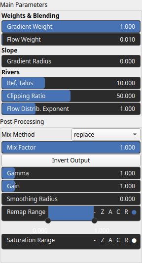
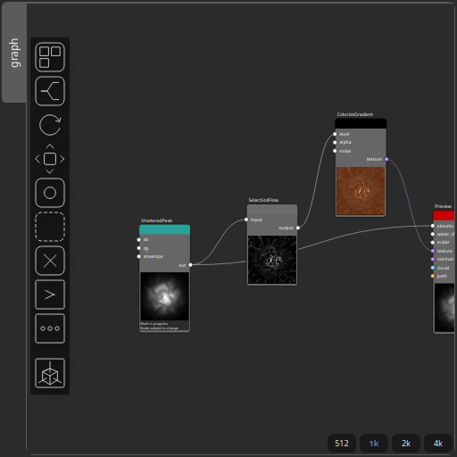

SelectSoilFlow Node
===================

Computes a soil–flow selection map based on the terrain gradient and the flow-accumulation map. This node can be for instance chained with ColorizeGradient for texturing.

# Category

Mask/ForTexturing
# Inputs

|Name|Type|Description|
| :--- | :--- | :--- |
|input|Heightmap|Input heightmap used to compute curvature and gradient contributions.|

# Outputs

|Name|Type|Description|
| :--- | :--- | :--- |
|output|Heightmap|Output soil-flow mask combining flow and gradient effects.|

# Parameters

|Name|Type|Description|
| :--- | :--- | :--- |
|Clipping Ratio|Float|Flow accumulation clipping ratio. Smaller values will saturate the flow contrast.|
|Flow Distrib. Exponent|Float|Power-law (gamma) exponent applied to the flow values. Lower gamma flattens the distribution, higher gamma increases contrast and steepens the transition between low and high values.|
|Flow Weight|Float|Weight applied to the flow component in the final mix.|
|Gradient Weight|Float|Weight applied to the gradient component in the final mix.|
|Gain|Float|Set the gain. Gain is a power law transformation altering the distribution of signal values, compressing or expanding certain regions of the signal depending on the exponent of the power law.|
|Gamma|Float|No description|
|Invert Output|Bool|Inverts the output values after processing, flipping low and high values across the midrange.|
|Mix Factor|Float|No description|
|Mix Method|Enumeration|No description|
|Remap Range|Value range|Linearly remaps the output values to a specified target range (default is [0, 1]).|
|Saturation Range|Value range|Modifies the amplitude of elevations by first clamping them to a given interval and then scaling them so that the restricted interval matches the original input range. This enhances contrast in elevation variations while maintaining overall structure.|
|Smoothing Radius|Float|Defines the radius for post-processing smoothing, determining the size of the neighborhood used to average local values and reduce high-frequency detail. A radius of 0 disables smoothing.|
|Gradient Radius|Float|Radius used to compute local gradient magnitudes, defining the neighborhood size influencing slope estimation. Larger radii yield smooth gradients.|
|Ref. Talus|Float|Reference talus value for river extraction.|

# Example

Corresponding Hesiod file: [SelectSoilFlow.hsd](../../examples/SelectSoilFlow.hsd). Use [Ctrl+I] in the node editor to import a hsd file within your current project. 

> **Note:** Example files are kept up-to-date with the latest version of [Hesiod](https://github.com/otto-link/Hesiod).
> If you find an error, please [open an issue](https://github.com/otto-link/Hesiod/issues).

