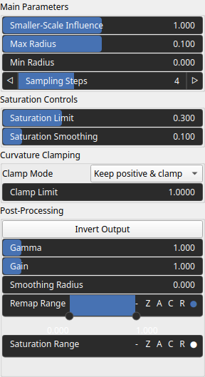
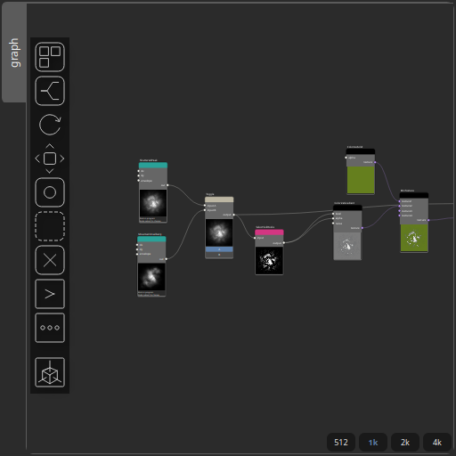

SelectSoilRocks Node
====================

No description available

# Category

Mask/ForTexturing
# Inputs

|Name|Type|Description|
| :--- | :--- | :--- |
|input|Heightmap|No description|

# Outputs

|Name|Type|Description|
| :--- | :--- | :--- |
|output|Heightmap|No description|

# Parameters

|Name|Type|Description|
| :--- | :--- | :--- |
|Clamp Mode|Enumeration|No description|
|Clamp Limit|Float|No description|
|Saturation Smoothing|Float|No description|
|Gain|Float|No description|
|Invert Output|Bool|No description|
|Remap Range|Value range|No description|
|Saturation Range|Value range|No description|
|Smoothing Radius|Float|No description|
|Max Radius|Float|No description|
|Min Radius|Float|No description|
|Saturation Limit|Float|No description|
|Smaller-Scale Influence|Float|No description|
|Sampling Steps|Integer|No description|

# Example

Corresponding Hesiod file: [SelectSoilRocks.hsd](../../examples/SelectSoilRocks.hsd). Use [Ctrl+I] in the node editor to import a hsd file within your current project. 

> **Note:** Example files are kept up-to-date with the latest version of [Hesiod](https://github.com/otto-link/Hesiod).
> If you find an error, please [open an issue](https://github.com/otto-link/Hesiod/issues).

