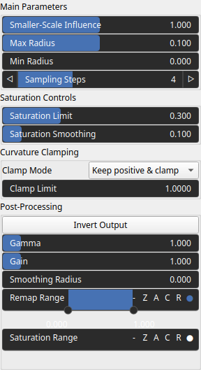
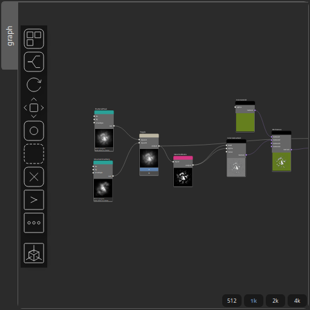

SelectSoilRocks Node
====================

Computes a multi-scale soil/rock mask using curvature analysis across progressively larger smoothing radii.

# Category

Mask/ForTexturing
# Inputs

|Name|Type|Description|
| :--- | :--- | :--- |
|input|Heightmap|Input heightmap or scalar field used to compute curvature across scales.|

# Outputs

|Name|Type|Description|
| :--- | :--- | :--- |
|output|Heightmap|Computed multi-scale soil/rock selection mask.|

# Parameters

|Name|Type|Description|
| :--- | :--- | :--- |
|Clamp Mode|Enumeration|Defines how curvature values are clamped before accumulation across scales.|
|Clamp Limit|Float|Threshold used to clamp curvature values at each scale.|
|Saturation Smoothing|Float|Controls the smoothness of the saturation response applied after curvature aggregation.|
|Gain|Float|Mid-centered gain transformation applied to the elevation values. This is a non-linear recurve operator centered around the mid elevation (typically 0.5). Increasing the gain pushes values toward the minimum and maximum elevations, creating flatter low/high regions with a steeper transition around the midpoint.|
|Gamma|Float|Standard gamma correction applied to the elevation values. This is a monotonic power-law remapping that shifts emphasis toward low or high elevations, making the overall shape sharper or bulkier without changing its ordering.|
|Invert Output|Bool|Inverts the output values after processing, flipping low and high values across the midrange.|
|Mix Factor|Float|Mixing factor for blending input and output values. A value of 0 uses only the input, 1 uses only the output, and intermediate values perform a linear interpolation.|
|Mix Method|Enumeration|Method used to combine input and output values. Options include linear interpolation (default), min, max, smooth min, smooth max, add, and subtract.|
|Remap Range|Value range|Linearly remaps the output values to a specified target range (default is [0, 1]).|
|Saturation Range|Value range|Modifies the amplitude of elevations by first clamping them to a given interval and then scaling them so that the restricted interval matches the original input range. This enhances contrast in elevation variations while maintaining overall structure.|
|Smoothing Radius|Float|Defines the radius for post-processing smoothing, determining the size of the neighborhood used to average local values and reduce high-frequency detail. A radius of 0 disables smoothing.|
|Max Radius|Float|Maximum smoothing radius used when evaluating curvature across logarithmic scales.|
|Min Radius|Float|Minimum smoothing radius.|
|Saturation Limit|Float|Limits the maximum saturation effect applied during the output shaping stage.|
|Smaller-Scale Influence|Float|Weight applied when descending to smaller smoothing radii, allowing fine-scale features to contribute more or less strongly.|
|Sampling Steps|Integer|Number of logarithmic scales evaluated between rmin and rmax.|

# Example

Corresponding Hesiod file: [SelectSoilRocks.hsd](../../examples/SelectSoilRocks.hsd). Use [Ctrl+I] in the node editor to import a hsd file within your current project. 

> **Note:** Example files are kept up-to-date with the latest version of [Hesiod](https://github.com/otto-link/Hesiod).
> If you find an error, please [open an issue](https://github.com/otto-link/Hesiod/issues).

