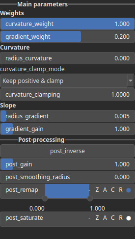
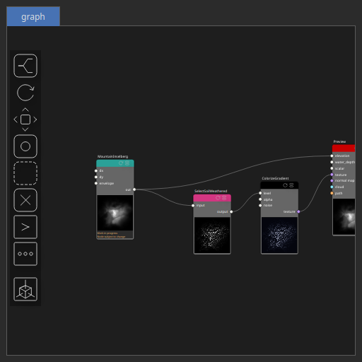

SelectSoilWeathered Node
========================

Generates a soil-weathering selection mask by combining curvature and gradient analysis from the input heightmap. This node can be for instance chained with ColorizeGradient for texturing.

# Category

Mask/ForTexturing
# Inputs

|Name|Type|Description|
| :--- | :--- | :--- |
|input|Heightmap|Input heightmap used to compute curvature and gradient contributions.|

# Outputs

|Name|Type|Description|
| :--- | :--- | :--- |
|output|Heightmap|Output soil-weathered mask combining curvature and gradient effects.|

# Parameters

|Name|Type|Description|
| :--- | :--- | :--- |
|Curvature Clamp Mode|Enumeration|Clamping mode applied to curvature values before mixing. Determines how positive and negative curvature values are limited. Positive curvature corresponds to convex terrain features such as bumps or ridges, while negative curvature corresponds to concave forms such as rifts, valleys, or depressions. Use the clamping mode to keep or suppress one of these curvature types depending on the effect you want to emphasize.|
|Curvature Clamp Limit|Float|Maximum absolute curvature value allowed after clamping. Smaller values will saturate the curvature contrast.|
|Curvature Weight|Float|Weight applied to the curvature component in the final weathering mix. Can be negative to invert curvature contribution.|
|Gradient Gain|Float|Controls how sensitive the gradient contribution is to slope intensity. A higher gain produces a steeper, more contrast-like transition from 0 to 1, making the influence of slope change more abruptly.|
|Gradient Weight|Float|Weight applied to the gradient component in the final weathering mix. Can be negative to invert the gradient contribution. Increasing the gradient weight will result in stronger selection based solely on elevation slope, independently of curvature, i.e. bumps, or ridge detection.|
|Gain|Float|Set the gain. Gain is a power law transformation altering the distribution of signal values, compressing or expanding certain regions of the signal depending on the exponent of the power law.|
|Invert Output|Bool|Inverts the output values after processing, flipping low and high values across the midrange.|
|Remap Range|Value range|Linearly remaps the output values to a specified target range (default is [0, 1]).|
|Saturation Range|Value range|Modifies the amplitude of elevations by first clamping them to a given interval and then scaling them so that the restricted interval matches the original input range. This enhances contrast in elevation variations while maintaining overall structure.|
|Smoothing Radius|Float|Defines the radius for post-processing smoothing, determining the size of the neighborhood used to average local values and reduce high-frequency detail. A radius of 0 disables smoothing.|
|Curvature Radius|Float|Radius used for curvature computation. Larger radii capture broader-scale curvature.|
|Gradient Radius|Float|Radius used to compute local gradient magnitudes, defining the neighborhood size influencing slope estimation. Larger radii yield smooth gradients.|

# Example

Corresponding Hesiod file: [SelectSoilWeathered.hsd](../../examples/SelectSoilWeathered.hsd). Use [Ctrl+I] in the node editor to import a hsd file within your current project. 

> **Note:** Example files are kept up-to-date with the latest version of [Hesiod](https://github.com/otto-link/Hesiod).
> If you find an error, please [open an issue](https://github.com/otto-link/Hesiod/issues).

  
# Screenshots

