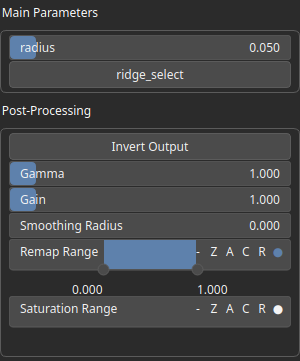

SelectValley Node
=================

Identifies and selects valley-like regions in the heightmap based on curvature analysis. The selection can be inverted, and additional parameters allow fine-tuning of the selection process. The output is a mask representing the relative width of the valley. The value is 1 at the valley center and decreases to 0 at the edges of the valley.

# Category

Mask/Selector
# Inputs

|Name|Type|Description|
| :--- | :--- | :--- |
|input|Heightmap|Heightmap data used as input for valley detection.|

# Outputs

|Name|Type|Description|
| :--- | :--- | :--- |
|output|Heightmap|A mask representing the relative width of the valley. The value is 1 at the valley center and decreases to 0 at the edges of the valley.|

# Parameters

|Name|Type|Description|
| :--- | :--- | :--- |
|GPU|Bool|Enables or disables GPU acceleration for faster processing.|
|Gain|Float|Set the gain. Gain is a power law transformation altering the distribution of signal values, compressing or expanding certain regions of the signal depending on the exponent of the power law.|
|Invert Output|Bool|Inverts the output values after processing, flipping low and high values across the midrange.|
|Remap Range|Value range|Linearly remaps the output values to a specified target range (default is [0, 1]).|
|Saturation Range|Value range|Modifies the amplitude of elevations by first clamping them to a given interval and then scaling them so that the restricted interval matches the original input range. This enhances contrast in elevation variations while maintaining overall structure.|
|Smoothing Radius|Float|Defines the radius for post-processing smoothing, determining the size of the neighborhood used to average local values and reduce high-frequency detail. A radius of 0 disables smoothing.|
|radius|Float|Defines the search radius for valley detection, controlling how localized or broad the selection is.|
|ridge_select|Bool|If enabled, selects ridges instead of valleys.|

# Example

No example available.