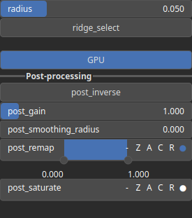

SelectValley Node
=================

Identifies and selects valley-like regions in the heightmap based on curvature analysis. The selection can be inverted, and additional parameters allow fine-tuning of the selection process. The output is a mask representing the relative width of the valley. The value is 1 at the valley center and decreases to 0 at the edges of the valley.

# Category

Mask/Selector
# Inputs

|Name|Type|Description|
| :--- | :--- | :--- |
|input|Heightmap|Heightmap data used as input for valley detection.|

# Outputs

|Name|Type|Description|
| :--- | :--- | :--- |
|output|Heightmap|A mask representing the relative width of the valley. The value is 1 at the valley center and decreases to 0 at the edges of the valley.|

# Parameters

|Name|Type|Description|
| :--- | :--- | :--- |
|GPU|Bool|Enables or disables GPU acceleration for faster processing.|
|post_gain|Float|No description|
|post_inverse|Bool|No description|
|post_remap|Value range|No description|
|post_smoothing_radius|Float|No description|
|radius|Float|Defines the search radius for valley detection, controlling how localized or broad the selection is.|
|ridge_select|Bool|If enabled, selects ridges instead of valleys.|

# Example

