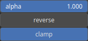

SetAlpha Node
=============

SetAlpha adjusts the transparency of a texture based on an input alpha value, which can either be a single scalar or an array. When provided with a scalar alpha value, the function uniformly adjusts the transparency of the entire texture. Alternatively, when given an array of alpha values, it enables fine-grained control over the transparency of different parts of the texture, allowing for varied opacity across the texture's surface.

# Category

Texture
# Inputs

|Name|Type|Description|
| :--- | :--- | :--- |
|alpha|Heightmap|Transparency (expected to be in [0, 1]).|
|noise|Heightmap|TODO|
|texture in|HeightmapRGBA|TODO|

# Outputs

|Name|Type|Description|
| :--- | :--- | :--- |
|texture out|HeightmapRGBA|TODO|

# Parameters

|Name|Type|Description|
| :--- | :--- | :--- |
|alpha|Float|Transparency as a scalar value (overriden if this alpha input is set).|
|clamp|Bool|TODO|
|reverse|Bool|TODO|

# Example

