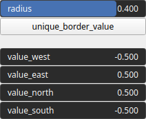

SetBorders Node
===============

TODO

## Category

Boundaries
## Inputs

|Name|Type|Description|
| :--- | :--- | :--- |
|input|VirtualArray|TODO|

## Outputs

|Name|Type|Description|
| :--- | :--- | :--- |
|output|VirtualArray|TODO|

## Parameters

|Name|Type|Description|
| :--- | :--- | :--- |
|Radius|Float|TODO|
|East|Float|East-edge buffer thickness (fraction of width).|
|North|Float|North (top) edge buffer thickness (fraction of height).|
|South|Float|South (bottom) edge buffer thickness (fraction of height).|
|West|Float|West-edge buffer thickness (fraction of width).|
|Uniform Radius|Bool|No description|
|Uniform Value|Bool|No description|
|Value|Float|No description|
|East|Float|TODO|
|North|Float|TODO|
|South|Float|TODO|
|West|Float|TODO|

## Example

Corresponding Hesiod file: [SetBorders.hsd](../../examples/SetBorders.hsd). Use [Ctrl+I] in the node editor to import a hsd file within your current project.

!!! note
    Example files are kept up-to-date with the latest version of [Hesiod](https://github.com/otto-link/Hesiod).
    If you find an error, please [open an issue](https://github.com/otto-link/Hesiod/issues).

