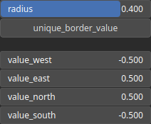

SetBorders Node
===============

TODO

# Category

Boundaries
# Inputs

|Name|Type|Description|
| :--- | :--- | :--- |
|input|Heightmap|TODO|

# Outputs

|Name|Type|Description|
| :--- | :--- | :--- |
|output|Heightmap|TODO|

# Parameters

|Name|Type|Description|
| :--- | :--- | :--- |
|radius|Float|TODO|
|unique_border_value|Bool|TODO|
|value_east|Float|TODO|
|value_north|Float|TODO|
|value_south|Float|TODO|
|value_west|Float|TODO|

# Example

No example available.