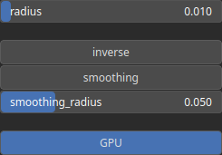

ShapeIndex Node
===============

ShapeIndex is a measure used to quantify the shape complexity of landforms in an heightmap. It is calculated based on the second derivatives of the elevation surface. The surface index is greater than 0.5 for convex surface and lower than 0.5 for concave surface.

# Category

Filter/Smoothing
# Inputs

|Name|Type|Description|
| :--- | :--- | :--- |
|input|Heightmap|Input heightmap.|

# Outputs

|Name|Type|Description|
| :--- | :--- | :--- |
|output|Heightmap|Shape index.|

# Parameters

|Name|Type|Description|
| :--- | :--- | :--- |
|GPU|Bool|TODO|
|inverse|Bool|Toggle inversion of the output values.|
|radius|Float|Filter radius with respect to the domain size.|
|smoothing|Bool|Enable or disable smoothing to reduce noise in the curvature computation.|
|smoothing_radius|Float|Specifies the radius for smoothing, determining how much the curvature is averaged over neighboring pixels.|

# Example

