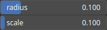

SharpenCone Node
================

SharpenCone is a cone kernel-based sharpen operator enhancing sharpness by emphasizing edges and fine details using a radial gradient shape.

# Category

Filter/Smoothing
# Inputs

|Name|Type|Description|
| :--- | :--- | :--- |
|input|Heightmap|Input heightmap.|
|mask|Heightmap|Mask defining the filtering intensity (expected in [0, 1]).|

# Outputs

|Name|Type|Description|
| :--- | :--- | :--- |
|output|Heightmap|Filtered heightmap.|

# Parameters

|Name|Type|Description|
| :--- | :--- | :--- |
|radius|Float|Filter radius with respect to the domain size.|
|scale|Float|Sharpening intensity.|

# Example

No example available.