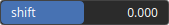

ShiftElevation Node
===================

The ShiftElevation operator involves adjusting each data point by adding it with a predetermined constant.

## Category

Filter/Range
## Inputs

|Name|Type|Description|
| :--- | :--- | :--- |
|input|VirtualArray|Input heightmap.|

## Outputs

|Name|Type|Description|
| :--- | :--- | :--- |
|output|VirtualArray|Resulting heightmap after applying the shift.|

## Parameters

|Name|Type|Description|
| :--- | :--- | :--- |
|shift|Float|Constant by which each elevation values will be added.|

## Example

Corresponding Hesiod file: [ShiftElevation.hsd](../../examples/ShiftElevation.hsd). Use [Ctrl+I] in the node editor to import a hsd file within your current project.

!!! note
    Example files are kept up-to-date with the latest version of [Hesiod](https://github.com/otto-link/Hesiod).
    If you find an error, please [open an issue](https://github.com/otto-link/Hesiod/issues).

