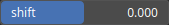

ShiftElevation Node
===================

The ShiftElevation operator involves adjusting each data point by adding it with a predetermined constant.

# Category

Filter/Range
# Inputs

|Name|Type|Description|
| :--- | :--- | :--- |
|input|Heightmap|Input heightmap.|

# Outputs

|Name|Type|Description|
| :--- | :--- | :--- |
|output|Heightmap|Resulting heightmap after applying the shift.|

# Parameters

|Name|Type|Description|
| :--- | :--- | :--- |
|shift|Float|Constant by which each elevation values will be added.|

# Example

