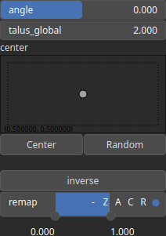

Slope Node
==========

Slope is function used to represent continuous terrain slope.

# Category

Primitive/Function
# Inputs

|Name|Type|Description|
| :--- | :--- | :--- |
|control|Heightmap|Control parameter, acts as a multiplier for the weight parameter.|
|dx|Heightmap|Displacement with respect to the domain size (x-direction).|
|dy|Heightmap|Displacement with respect to the domain size (y-direction).|

# Outputs

|Name|Type|Description|
| :--- | :--- | :--- |
|output|Heightmap|Slope heightmap.|

# Parameters

|Name|Type|Description|
| :--- | :--- | :--- |
|angle|Float|Angle.|
|center|Vec2Float|Reference center within the heightmap.|
|inverse|Bool|Toggle inversion of the output values.|
|remap|Value range|Remap the operator's output to a specified range, defaulting to [0, 1].|
|talus_global|Float|Slope slope...|

# Example

No example available.