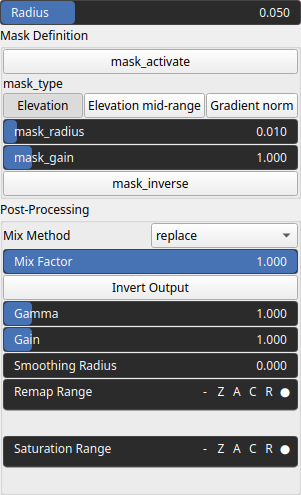

SmoothCpulse Node
=================

Smoothing using a cubic pulse kernel can be considered somewhat similar to Gaussian smoothing. This technique is used to reduce noise and smooth data. The cubic pulse kernel has a cubic decrease in influence with distance within a finite interval. It is zero beyond a certain radius, providing a compact support that affects only nearby points.

# Category

Filter/Smoothing
# Inputs

|Name|Type|Description|
| :--- | :--- | :--- |
|input|Heightmap|Input heightmap.|
|mask|Heightmap|Mask defining the filtering intensity (expected in [0, 1]).|

# Outputs

|Name|Type|Description|
| :--- | :--- | :--- |
|output|Heightmap|Filtered heightmap.|

# Parameters

|Name|Type|Description|
| :--- | :--- | :--- |
|GPU|Bool|Toogle GPU acceleration on or off.|
|radius|Float|Filter radius with respect to the domain size.|

# Example

