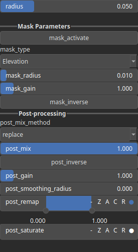

SmoothCpulse Node
=================

Smoothing using a cubic pulse kernel can be considered somewhat similar to Gaussian smoothing. This technique is used to reduce noise and smooth data. The cubic pulse kernel has a cubic decrease in influence with distance within a finite interval. It is zero beyond a certain radius, providing a compact support that affects only nearby points.

# Category

Filter/Smoothing
# Inputs

|Name|Type|Description|
| :--- | :--- | :--- |
|input|Heightmap|Input heightmap.|
|mask|Heightmap|Mask defining the filtering intensity (expected in [0, 1]).|

# Outputs

|Name|Type|Description|
| :--- | :--- | :--- |
|output|Heightmap|Filtered heightmap.|

# Parameters

|Name|Type|Description|
| :--- | :--- | :--- |
|mask_activate|Bool|Enables or disables the internal mask. If the node's 'mask' input is connected, this setting is bypassed and the input mask is used instead.|
|mask_gain|Float|Controls the intensity or influence of the internal mask. Bypassed if the 'mask' input is connected.|
|mask_inverse|Bool|Inverts the internal mask, applying the operator where the mask is low. Ignored if a 'mask' input is provided.|
|mask_radius|Float|Defines the smoothing radius for the internal mask. A value of 0 disables smoothing. This is bypassed if the 'mask' input is used.|
|mask_type|Choice|Specifies how the internal mask is computed: 'Elevation' uses height, 'Gradient Norm' uses slope, and 'Elevation mid-range' selects the middle portion of the height range. This parameter is ignored when a 'mask' input is connected.|
|post_gain|Float|No description|
|post_inverse|Bool|No description|
|post_mix|Float|No description|
|post_mix_method|Enumeration|No description|
|post_remap|Value range|No description|
|post_smoothing_radius|Float|No description|
|radius|Float|Filter radius with respect to the domain size.|

# Example

